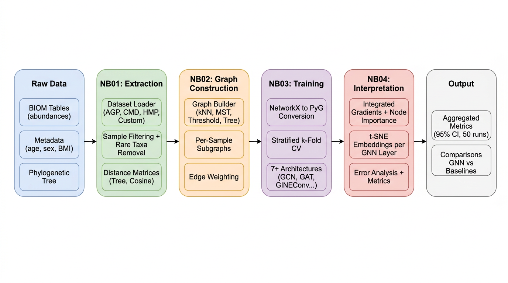
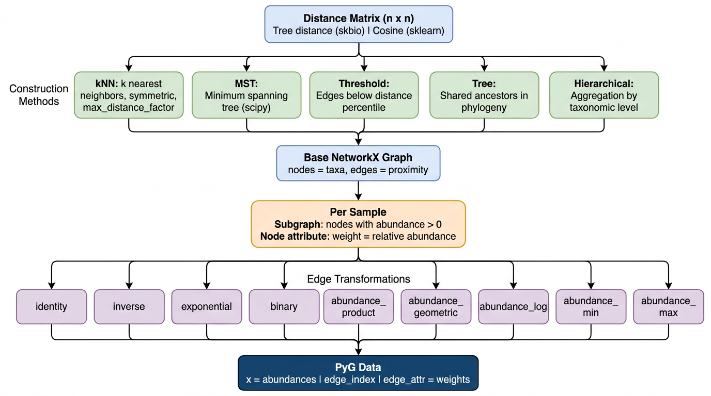
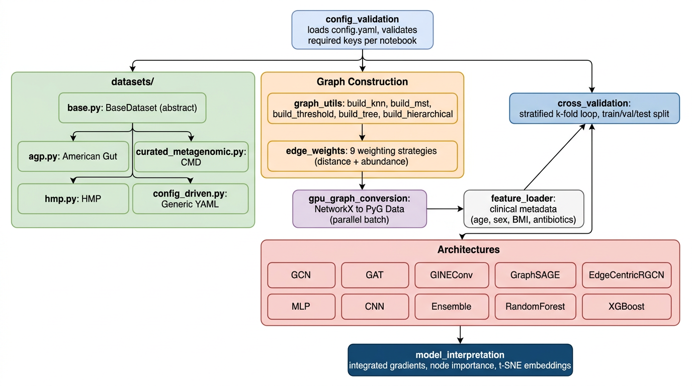

# BiomeML

*[English version](README.en.md)*

[](https://www.python.org/)
[](https://pytorch.org/)
[](https://pyg.org/)
[](LICENSE)
[](https://pixi.sh/)

Classification de maladies a partir du microbiome intestinal en utilisant des reseaux de neurones sur graphes (GNN), avec support multi-dataset.

## Pourquoi ce projet

Le microbiome intestinal humain contient des milliers de taxons microbiens relies par des relations phylogenetiques. Les approches classiques de machine learning (MLP, Random Forest) traitent ces taxons comme des variables independantes et ignorent la structure evolutive qui les relie. BiomeML encode les relations entre microbes sous forme de graphes ou chaque noeud represente un taxon et chaque arete represente une proximite phylogenetique, puis utilise des GNN pour exploiter cette structure lors de la classification malade/sain.

## Architecture

### Pipeline global

Le projet s'execute en 5 etapes orchestrees par des notebooks Jupyter. Chaque etape est pilotee par un fichier de configuration YAML centralise.



### Construction de graphes

La transformation des donnees brutes en graphes est l'etape qui differencie BiomeML des approches classiques.



### Modules `src/`



## Datasets supportes

| Dataset | Description | Maladies |
|---------|-------------|----------|
| **AGP** | American Gut Project | IBD, Diabetes, Cancer, Depression, + 6 autres |
| **CMD** | curatedMetagenomicData | CRC, IBD, T2D, Cirrhosis, Obesity |
| **HMP** | Human Microbiome Project / IBDMDB | IBD, Crohn's, UC |
| **Custom** | Donnees utilisateur | Definies via YAML |

## Demarrage rapide

```bash
git clone https://github.com/rayanebelhadj/BiomeML.git
cd BiomeML
pixi install
pixi run check          # verifier l'environnement
pixi run menu           # menu interactif
pixi run app            # tableau de bord Streamlit
```

### Lancer des experiences

```bash
pixi run run --list                                         # lister les experiences
pixi run run --experiments cmd_ibd_baseline --num-runs 50   # une experience
pixi run run --all --num-runs 50                            # toutes les experiences
```

## Technologies

| Categorie | Outils |
|-----------|--------|
| Deep Learning | PyTorch, PyTorch Geometric |
| Graphes | NetworkX, scikit-bio |
| ML classique | scikit-learn, XGBoost |
| Visualisation | Plotly, Matplotlib, Seaborn |
| Interface | Streamlit |
| Donnees | pandas, NumPy, BIOM-format |
| Environnement | pixi |

## Structure du projet

```
BiomeML/
├── src/
│   ├── datasets/              # Loaders multi-dataset
│   │   ├── base.py            # Interface abstraite BaseDataset
│   │   ├── agp.py             # American Gut Project
│   │   ├── curated_metagenomic.py
│   │   ├── hmp.py             # Human Microbiome Project
│   │   └── config_driven.py   # Loader generique YAML-driven
│   ├── models.py              # 10 architectures (GNN + baselines)
│   ├── cross_validation.py    # Entrainement k-fold stratifie
│   ├── graph_utils.py         # 5 methodes de construction de graphes
│   ├── edge_weights.py        # 9 strategies de ponderation
│   ├── gpu_graph_conversion.py # Conversion NetworkX vers PyG
│   ├── config_validation.py   # Validation stricte de config
│   ├── feature_loader.py      # Metadonnees cliniques
│   └── model_interpretation.py # Gradients, embeddings, analyse
│
├── notebooks/                 # Pipeline en 5 etapes
│   ├── 00_dataset_overview.ipynb
│   ├── 01_data_extraction.ipynb
│   ├── 02_graph_construction.ipynb
│   ├── 03_model_training.ipynb
│   └── 04_model_interpretation.ipynb
│
├── scripts/
│   ├── run_experiments.py     # Orchestrateur d'experiences
│   ├── run_interactive.py     # Menu interactif CLI
│   ├── analyze_results.py     # Analyse statistique
│   └── create_visualizations.py
│
├── ui/                        # Tableau de bord Streamlit
│   ├── app.py
│   ├── pages/
│   └── components/
│
├── datasets_config/           # Configuration par dataset (YAML)
├── tests/                     # Tests unitaires et d'integration
├── config.yaml                # Configuration globale
├── experiments.yaml           # Definitions des experiences
└── pixi.toml                  # Environnement et taches
```

## Architectures

| Modele | Type | Description |
|--------|------|-------------|
| GCN | GNN | Graph Convolutional Network |
| GAT | GNN | Graph Attention Network |
| GINEConv | GNN | Graph Isomorphism Network avec attributs d'aretes |
| GraphSAGE | GNN | Echantillonnage et aggregation de voisinage |
| EdgeCentricRGCN | GNN | GCN relationnel centre sur les aretes |
| MLP | Baseline | Perceptron multicouche (ignore la structure de graphe) |
| CNN | Baseline | Reseau convolutif 1D sur les abondances |
| Ensemble | Hybride | Combinaison de modeles |
| RandomForest | ML classique | Via scikit-learn |
| XGBoost | ML classique | Gradient boosting |

## Configuration

Selection du dataset dans `config.yaml` :

```yaml
dataset:
  name: "cmd"
  config_file: "datasets_config/cmd.yaml"
```

Chaque dataset a son fichier dans `datasets_config/` avec les chemins, colonnes et conditions specifiques.

Les experiences sont definies dans `experiments.yaml` avec des overrides de configuration qui sont fusionnees avec la config de base.

## Tests

```bash
pytest tests/ -v
```

## Licence

[MIT](LICENSE)
